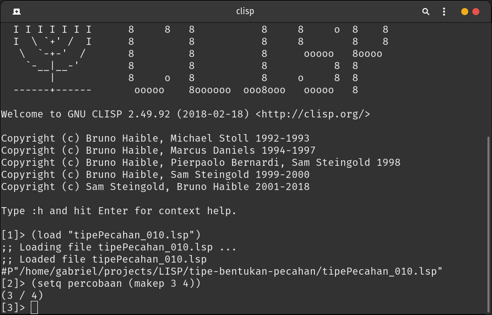

# <b>Tipe Bentukan Pecahan</b>

Ini adalah program yang dibuat dari bahasa pemrograman LISP. Fitur-fitur dari program ini:
1. Menentukan pembilang.
2. Menentukan penyebut
3. Membentuk pecahan berbentuk a / b
4. Melakukan operasi penjumlahan pecahan
5. Melakukan operasi pengurangan pecahan
6. Melakukan operasi perkalian pada pecahan
7. Melakukan operasi pembagian pada pecahan
8. Menentukan apakah pecahan-1 dengan pecahan-2 sama
9. Menentukan apakah pecahan-1 lebih kecil dari pecahan-2

## <b>How to Use?</b>

Berikut cara menggunakannya:
1. Buka CLISP.
2. Kemudian load file ini.
3. Ketikkan perintah berikut untuk membuat betuk pecahan. Dengan:
   - a = pembilang
   - b = penyebut
  ```
  (setq nama_fungsi_1 (makep a b))
  (setq nama_fungsi_2 (makep a b))
  (setq nama_fungsi_3 (makep a b))
  ```
4. Ketikkan perintah berikut untuk menentukan pembilang.
   ```
   (pemb nama_fungsi)
   ```
5. Ketikkan perintah berikut untuk menentukan penyebut.
   ```
   (peny nama_fungsi)
   ```
6. Ketikkan perintah berikut untuk menjumlahkan pecahan.
   ```
   (addp nama_fungsi_1 nama_fungsi_2)
   ```
7. Ketikkan perintah berikut untuk mengurangkan pecahan.
   ```
   (subp nama_fungsi_1 nama_fungsi_2)
   ```
8. Ketikkan perintah berikut untuk mengalikan pecahan.
    ```
    (mulp nama_fungsi_1 nama_fungsi_2)
    ```
9. Ketikkan perintah berikut untuk mengalikan pembagian.
    ```
    (divp nama_fungsi_1 nama_fungsi_2)
    ```
10. Ketikkan perintah berikut untuk menentukan apakah Pecahan-1 = Pecahan-2. Akan keluar output <b>T</b> apabila pecahan *bernilai sama* dan akan keluar output **nil** apabila pecahan *tidak bernilai sama*.
    ```
    (iseqp nama_fungsi_1 nama_fungsi_2)
    ```
11. Ketikkan perintah berikut untuk menentukan apakah Pecahan-1 < Pecahan-2. Akan keluar output <b>T</b> apabila nilai pecahan *bernilai lebih kecil* dan akan keluar output **nil** apabila nilai pecahan *tidak bernilai lebih kecil*.
    ```
    (isltp nama_fungsi_1 nama_fungsi_2)
    ```

## <b>About Me</b>

I'm a student at Del Institute of Technology. <br>
Bachelor of Informatics study program. <br>


<button><a href="https://www.instagram.com/gabrielhtg77/">My Instagram</a></button>
<br>
<button><a href="https://www.del.ac.id/">Institut Teknologi Del</a></button>

## <b>Screenshot</b>

